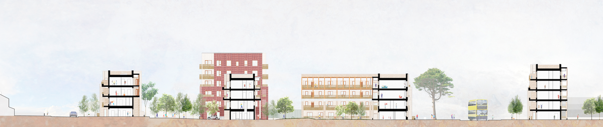
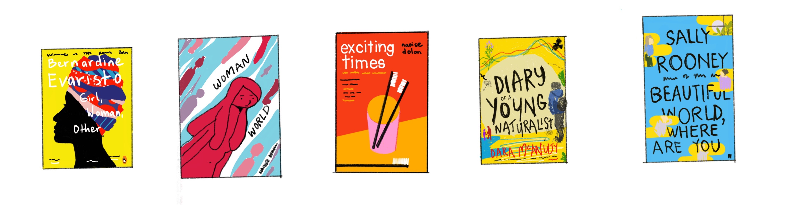

<h1>Marie Mc Guinness &nbsp;

</h1>

| [Tech](#tech) | [Projects](#projects) | [Skills](#skills) | [Education](#education) | [Experience](#experience) | [Hobbies](#hobbies) |

Full-stack software developer and recent graduate of [Makers Academy](https://makers.tech/about-us/) coding bootcamp. After spending ten years working in the construction industry, I have embarked on a new path to develop my coding skills and build something completely different.

The expertise I developed as an architect, that I bring with me to my new role include creativity, problem solving, teamwork, collaboration, strong visual communication skills and experience bringing complex projects from beginning to end.

I'm looking for a junior software development role in an agile team where I can further develop my skill set and build simple, clean code with a company who are passionate about what they do.

## Tech Experience

Makers Academy **12 week immersive full-stack engineering bootcamp** with a strong focus on:

- Self-learning
- Language agnostic process for learning
- Software craftsmanship: SOLID, OPP, TDD, BDD
- Group projects & pair programming
- Coding reviews - live tech test of TDD process
- Agile methodologies and XP values
- Curiosity and a growth mindset

## Projects

Selected projects to demonstrate what I have learnt:

| Name                                                                                                                                           | Description                                                                                                                                                                                                             | Timeframe              | Tech                                           |
| ----------------------------------------------------------------------------------------------------------------------------------------- | ----------------------------------------------------------------------------------------------------------------------------------------------------------------------------------------------------------------------- | ---------------------- | ---------------------------------------------- |
| **[Get me out of here!](https://github.com/mmguinness/escape-room)**        | We created an interactive escape room game to explore our front-end capabilities.                                                                                                                                       | Two week group project | React, JavaScript, Node.js, HTML, CSS                     |
| **[Bank Tech test](https://github.com/mmguinness/Bank_tech_test)**                                                                       | A command line app to emulate a bank account. This is a practice project to demonstrate basic TDD and OOP principles.                                                                                                     | Solo project   | Ruby, RSpec, Rubocop                           |
| **[Chitter API](https://github.com/mmguinness/frontend-api-challenge)**                                                                   | The backend API is provided for this Twitter clone, the task is to build a front-end single-page-app to interface with this API. | Weekend solo project   | JavaScript, Jest, HTML, CSS                    |
| **[Chitter](https://github.com/mmguinness/chitter-challenge)**                                                                            | A Twitter clone with SQL database                                                                                                                                                                                       | Weekend solo project   | Ruby, Rspec, Capybara, Sinatra, HTML, CSS, SQL |
| **[Makers BnB](https://github.com/mmguinness/makersbnb)**                                                                                 | Air bnb clone. This web application that allows users to list spaces they have available, and to hire spaces for the night.                                                                                             | Two week group project | Ruby, Rspec, Capybara, Sinatra, HTML, CSS, SQL |
| **[Bowling Scorecard](https://github.com/mmguinness/bowling-challenge-ruby)**                                                             | Count and sum the scores of a bowling game for one player.                                                                                                                                                              | Weekend solo project   | Ruby, Rspec, Capybara, Sinatra, HTML, CSS      |
| **[Rock Paper Scissors](https://github.com/mmguinness/rps-challenge)**  | Rock Paper Scissors Game &nbsp;      | Weekend solo project   | Ruby, Rspec, Capybara, Sinatra, HTML, CSS      |

## Education

2022 | Full-Stack Engineering Bootcamp - **Makers Academy** (remote)  
2021 | Learn Ruby - **[Code Academy](https://www.codecademy.com/learn/learn-ruby)** (online)  
2021 | Responsive Web Design - **[freecodecamp](https://www.freecodecamp.org/learn/responsive-web-design)** (online)  
2021 | 100 minute Tutorial on Ruby - **[Jumpstart Lab](http://tutorials.jumpstartlab.com/projects/ruby_in_100_minutes.html)** (online)  
2021 | Introduction to Coding with Ruby - **[Udemy](https://www.udemy.com/course/newbie-to-ruby/)** (online)  
2016 | Practical Programming for Total Beginners - **[Automate the boring stuff with Python](https://automatetheboringstuff.com/)** (online)  
2015 | Postgradute Diploma in Professional Practice - **University of Westminster**, London  
2006 | 2:1 BArch (Hons) Architecture - **Dublin School of Architecture**, Dublin Intitute of Technology  

## Experience

**[Metropolitan Workshop](https://metwork.co.uk/work/)**  
_Senior Architect (Nov 2019 to July 2021)_
 
I worked as part of a multi-disciplinary design team on a masterplan for 400 homes, a community space and park in North Dublin city. See the public consultation information for Cromcastle Court project in Dublin [here](https://consultation.dublincity.ie/north-central-area/cromcastle-court-and-the-old-coal-yard/).
We developed the design and planning application documentation for the first phase of 150 homes to be built using MMC (Modern Methods of Construction). 
<figure>
  <figcaption>Proposed section-cut through Cromcastle Court, Dublin</figcaption>
  
</figure>

**[DTA Architects](https://dta.ie/)**  
_Architect (Aug 2017 to Oct 2019)_

My focus was to develop detailed Tender and Construction information for a hotel located in a complex urban block in Dublin inner city. The drawings were produced with Vectorworks 3D, including details for a bespoke facade with a mix of folded metal cladding, brickwork and precast concrete elements. Take a look at the building in google street view [here](https://www.google.com/maps/@53.3451004,-6.2513933,3a,75y,239.76h,108.2t/data=!3m6!1e1!3m4!1slEvi_KxnqIc07cSEGZGxPA!2e0!7i16384!8i8192).

**[Satellite Architects](https://archello.com/project/friends-meeting-house)**  
_Architect (Sep 2015 to Jul 2016)_

My role involved designing bespoke details for small-scale projects including a boutique hotel at River Cottage in Devon, and a Quakers meeting house in Hammersmith, London.

**[Haverstock Architects](http://haverstock.com/)**  
_Architectural Assistant (Sep 2012 to Aug 2015)_

Haverstock works closely with clients, creating designs to meet their needs, and inspiring buildings to enhance people’s lives. I assisted with the full scope of work on educational projects including a SEN School in Poole, and a Primary School & Childrens Centre in Islington, London. Check out Moreland Primary School in google maps [here](https://www.google.com/maps/@51.5290407,-0.0990558,3a,75y,196.07h,92.2t/data=!3m6!1e1!3m4!1snmQ8PSZyzTRGWcILumS90Q!2e0!7i16384!8i8192) and more information [here](http://haverstock.com/project/moreland-school/).

## Skills

#### Creative

- Problem solving across all-scales - conceptual ideas down to small details
- I am a visual thinker, one of my favourite parts of Makers has been discovering a new type of diagram almost every week. When stuck on a problem or short on time, I lean on diagramming and planning. For example in my [Chitter API](https://github.com/mmguinness/frontend-api-challenge) weekend challenge.

#### Communication and Collaboration

- Developing briefs with clients/end-users and interpreting what is required
- Collaboration with design team, consultants, building-contractors, stakeholders and end-users
- Presentation skills, visual communication of ideas and presenting this to others

#### Professional

- Meticulous attention to detail
- Experience in team-management
- Time-management and delivering to a deadline
- Strive for efficeincy in design solution and workflows

## Hobbies

Every morning (almost), I walk in Phoenix Park and listen to podcasts, including [TRXL](https://www.trxl.co/), [Practice Distrupted](https://practiceofarchitecture.com/podcast/), [The Laravel Podcast](https://laravelpodcast.com/episodes/apis-with-jess-archer)
I enjoy [codewars](https://www.codewars.com/users/mmguinness), sketching, reading, gardening, cooking and baking sourdough bread. 
Sketches of some books I have been reading lately 

 

