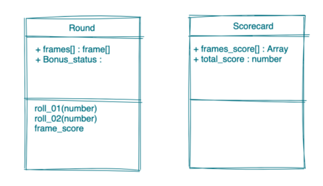

<h1>Marie Mc Guinness</h1>

 | [Projects](#projects) | [Skills](#skills) | [Education](#education) | [Work Experience](#work) | [Hobbies](#hobbies) |

Junior software developer and recent graduate of [Makers Academy](https://makers.tech/about-us/) coding bootcamp. After spending ten years working in the construction industry, I have embarked on a new path to develop my coding skills and build something new.

The expertise I developed as an architect that I hope to bring to my new role include creativity, problem solving, systems thinking, and experience bringing complex projects from beginning to end.

I'm looking for a junior software development role in an agile team where I can further develop my skill set and build simple, clean code with a company who are passionate about what they do.

## Projects

| Name                         | Description       |Timeframe          | Tech              |
| ---------------------------- | ----------------- | ----------------- | ----------------- |
| **[Rock Paper Scissors](https://github.com/mmguinness/rps-challenge)**  | A simple web-based rock-paper-scissors game. My first web game made in a weekend. | Two day solo project | Ruby, Rspec, Capybara, Sinatra, HTML, CSS |
| **[Bowling Scorecard](https://github.com/mmguinness/bowling-challenge-ruby)**  | Count and sum the scores of a bowling game for one player. | Two day solo project | Ruby, Rspec, Capybara, Sinatra, HTML, CSS |
| **[Get me out of here!](https://github.com/mmguinness/escape-room)**   |  We created an interactive escape room game to explore our front-end capabilities. | Two week group project | React, JavaScript, Node.js |
| **[Bank Tech test](https://github.com/mmguinness/Bank_tech_test)** | A simple program to emulate a bank account. This is a practice project to demonstrate basic TDD and OOP principles.  | Two day solo project | Ruby, RSpec, Rubocop   |

## Education

#### Makers Academy _(Jan 2022 to April 2022)_ 

**Strong focus on:**
- Self-learning
- Language agnostic process for learning 
- Software craftsmanship: SOLID, OPP, TDD, BDD
- Group projects & Pair Programming
- Agile methodologies and XP values
- Promotes curiosity and growth mindset

**Software:**
- Languages - Ruby and JavaScript
- Testing frameworks - Rspec, Capybara, Jest, Cypress
- Development frameworks - Sinatra, NodeJS, Express
- Front end HTML, CSS and React Library

#### University of Westminster 
_(Sep 2014 to Sep 2016)_
- Postgradute Diploma in Professional Practice.
- Required to use the title of Architect in the UK and Ireland.  

#### Dublin Institute of Technology / College _(Sep 2016 to Sep 2011)_ 
- Architecture
- 2:1 BArch (Hons) Architecture
- ERASMUS semester in Switzerland as part of Joint Master of Architecture in Bern University of Applied Sciences, Architecture, Wood and Civil Engineering

#### Any other qualifications
- Safe Pass Course (Building site health and safety)
- Over 5 years experience working in Building Information Modelling(BIM), numerous projects completed through collaborative BIM work-flow

## Work Experience

**[Metropolitan Workshop](https://metwork.co.uk/work/)** 
_Senior Architect (Nov 2019 to July 2021)_

- I worked as part of a multi-disciplinary design team on a masterplan for 400 homes, a community space and park in North Dublin city. 
- We developed the design and planning application documentation for the first phase of 150 homes to be built using MMC (Modern Methods of Construction). 

**[DTA Architects](https://dta.ie/)**   
_Architect (Aug 2017 to Oct 2019)_

- My focus was to develop detailed Tender and Construction documentation for a hotel located in a complex urban block in Dublin inner city. The drawings were produced with Vectorworks 3D, including details for a bespoke facade with a mix of folded metal cladding, brickwork and precast concrete elements.

**[Satellite Architects](https://archello.com/project/friends-meeting-house)**  
_Architect (Sep 2015 to Jul 2016)_

- My role involved designing bespoke details for small-scale projects including a boutique hotel at River Cottage in Devon, and a Quakers meeting house in Hammersmith, London.

**[Haverstock Architects](http://haverstock.com/)**  
_Architectural Assistant (Sep 2012 to Aug 2015)_

- Haverstock works closely with clients, creating designs to meet their needs, and inspiring buildings to enhance people’s lives.
- I assisted with the full scope of work on educational projects including a SEN School in Poole, and a Primary School & Childrens Centre in Islington, London.

## Skills

#### Creative 
- Problem solving across all-scales - conceptual ideas down to small details
- I am a visual thinker, one of my favourite parts of Makers has been discovering a new type of diagram almost every week.  

#### Communication and Collaboration
- Developing briefs with clients/end-users and interpreting what is required
- Collaboration with design team, consultants, building-contractors, stakeholders and end-users
- Presentation skills, visual communication of ideas and presenting this to others
Example of public consultations material for Cromcastle Court project in Dublin, 
Link: https://consultation.dublincity.ie/north-central-area/cromcastle-court-and-the-old-coal-yard/

#### Professional
- Meticulous attention to detail
- Experience in team-management 
- Time-management and delivering to a deadline
- Strive for efficeincy in design solution and workflows

## Hobbies

- Gardening, cooking and baking sourdough bread. I really enjoy trying new recipes, learning about new cuisines and incorporating this into my repertoire.
- Architecture and building/making things.